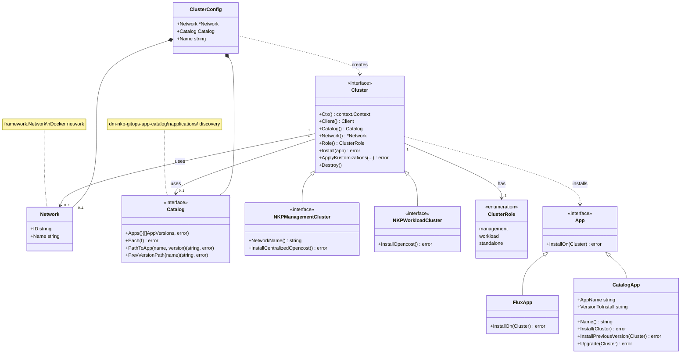

# Catalog apptests (common template over all catalog apps)

This package runs **table-driven** tests: one common template (install, upgrade, multicluster) is applied to **every app** under `applications/`, with no per-app test code. It lives at repo root as its own Go module (`catalog-apptests/`) and **does not depend on any upstream apptests library**.

## Object model

High-level objects: **Cluster** uses **Network** and **Catalog**, has a **Role**, and installs **App**s (Flux or catalog apps) by type. **ClusterConfig** binds Network + Catalog + Name when creating a cluster.

> **Mermaid in preview:** GitHub renders Mermaid in this README automatically. In Cursor/VS Code, install the [Markdown Preview Mermaid Support](https://marketplace.visualstudio.com/items?itemName=bierner.markdown-mermaid) extension, then use **Markdown: Open Preview** (or the preview pane) to see the diagram.



- **Network**: Docker network (framework); clusters are created on it.
- **Catalog**: Applications discovery; used by Cluster to resolve paths when installing catalog apps.
- **Cluster**: Uses Network and Catalog; **Role** (management | workload | standalone) determines install behavior (e.g. `InstallCentralizedOpencost` on management, `InstallOpencost` on workload).
- **ClusterConfig**: Passed to `KindCluster.Create(ctx, config)`; binds Network, optional Catalog, and Name.
- **App**: Installable unit; `FluxApp` or `CatalogApp`; `Cluster.Install(app)` dispatches by type.

## How it works

1. **Discovery** (`discovery.go`)  
   **Catalog** (interface) and **NewCatalog()** provide structured discovery: **Apps()**, **Each(f)** (iterator), **PathToApp(name, version)**, **PrevVersionPath(name)**. Package-level **ListCatalogApps()** uses **DefaultCatalog()** for backward compatibility.

2. **Cluster API** (`cluster.go`)  
   - **KindCluster.Create(ctx, ClusterConfig)** – creates a cluster (uses config.Network, config.Catalog, config.Name). Use for mgmt or standalone.
   - **KindCluster.CreateFromParent(ctx, mgmt, name)** – returns a workload cluster on the same network; inherits mgmt’s Catalog.
   - **cluster.Install(FluxApp)** – installs Flux (source-, kustomize-, helm-controller).
   - **cluster.Install(catalogApp)** – applies the app’s helmrelease kustomization (uses cluster’s Catalog for paths).
   - **cluster.Destroy()** – tears down the cluster(s).

3. **Framework** (`framework/`)  
   Self-contained helpers: Docker network, Kind cluster create/delete, K8s client from kubeconfig, Flux install (flux2 manifestgen + ssa apply), kustomize build + envsubst + apply. No dependency on `github.com/mesosphere/kommander-applications/apptests`.

4. **App types** (`app.go`)  
   **FluxApp** and **CatalogApp**; cluster.Install handles both. CatalogApp has Install, InstallPreviousVersion, Upgrade.

5. **Suite** (`suite_test.go`)  
   Single-cluster: for each app, install latest (and upgrade when ≥2 versions). Multicluster: mgmt + workload1 + workload2, install Flux and catalog app on each.

## Example (desired API)

```go
network, _ := framework.EnsureDockerNetworkExist(ctx, "", false)
catalog, _ := DefaultCatalog()

mgmt, _ := KindCluster.Create(ctx, ClusterConfig{Network: network, Catalog: catalog, Name: "mgmt"})
workload1, _ := KindCluster.CreateFromParent(ctx, mgmt, "workload1")
workload2, _ := KindCluster.CreateFromParent(ctx, mgmt, "workload2")

mgmt.Install(FluxApp)
workload1.Install(FluxApp)
workload2.Install(FluxApp)

catalogApp := NewCatalogApp("podinfo", "")
mgmt.Install(catalogApp)
workload1.Install(catalogApp)
workload2.Install(catalogApp)

defer mgmt.Destroy()
```

## Running

From **repo root**:

```bash
./catalog-workflow.sh test --catalog-apptests
./catalog-workflow.sh test --catalog-apptests --appname podinfo
./catalog-workflow.sh test --catalog-apptests -- -ginkgo.label-filter="multicluster"
```

With **go test** (from repo root):

```bash
cd catalog-apptests
go mod tidy
go test . -v -timeout 45m
go test . -v -timeout 45m -ginkgo.label-filter="appname=podinfo"
```

## Layout

```
catalog-apptests/
├── go.mod
├── framework/           # Self-contained: network, kind, client, flux, kustomize, scheme
│   ├── network.go
│   ├── kind.go
│   ├── client.go
│   ├── scheme.go
│   ├── flux.go
│   └── kustomize.go
├── app.go              # FluxApp, CatalogApp (cluster.Install pattern)
├── cluster.go          # Cluster interface; KindCluster.Create / CreateFromParent
├── discovery.go
├── constants.go
├── suite_test.go
└── README.md
```

## Dependencies

Direct dependencies (no upstream apptests): Docker client, Kind, Flux2 (manifestgen + install), fluxcd/pkg/ssa, fluxcd/source-controller and kustomize-controller APIs, kustomize, envsubst, ginkgo/gomega, controller-runtime.
